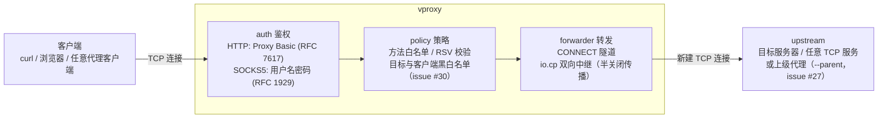

# vproxy

V 语言（Vlang）实现的一级代理集合，单一静态二进制即可提供 **HTTP**（含 CONNECT 与 WebSocket）、**SOCKS5**、**SOCKS4/SOCKS4a** 代理。轻量、多协议、可嵌入，面向「快速跑起来、行为可预测」的转发场景。

## 与其他代理的差异

| | vproxy | squid | mitmproxy | tinyproxy |
| --- | --- | --- | --- | --- |
| 形态 | V 语言，单一静态二进制 | C，重量级守护进程 | Python，交互式 CLI | C，轻量守护进程 |
| HTTP 代理 | ✅ CONNECT / WebSocket / Basic 鉴权 | ✅ 企业级缓存 + ACL | ✅ 中间人抓包 | ✅ 仅 HTTP |
| SOCKS | ✅ SOCKS5 / SOCKS4a | ❌ | ⚠️ 能力有限 | ❌ |
| 定位 | 可预测的最小转发代理 | 缓存 / 过滤网关 | 调试 / 审计工具 | 极简转发 |

> vproxy **不是**缓存服务器，也**不是**中间人调试器。它是一组可预测的最小代理：启动快、优雅退出、几行环境变量即可配置。

## 架构

所有代理共享同一条流水线：**client → auth → policy → forwarder → upstream**。


```mermaid
flowchart LR
    C["客户端<br/>curl / 浏览器 / 任意代理客户端"] -->|TCP 连接| A
    subgraph P1[vproxy]
        A["auth 鉴权<br/>HTTP: Proxy Basic (RFC 7617)<br/>SOCKS5: 用户名密码 (RFC 1929)"]
        P["policy 策略<br/>方法白名单 / RSV 校验<br/>目标与客户端黑白名单（issue #30）"]
        F["forwarder 转发<br/>CONNECT 隧道<br/>io.cp 双向中继（半关闭传播）"]
    end
    A --> P --> F -->|新建 TCP 连接| U["upstream<br/>目标服务器 / 任意 TCP 服务<br/>或上级代理（--parent，issue #27）"]
```

## ⚠️ 安全提示（生产部署前必读）

- **默认监听 `0.0.0.0`**：HTTP 默认 `:5777`、SOCKS5 默认 `:5778`、SOCKS4 默认 `:5779`。未绑定内网地址时，任何能到达主机的客户端都能连入。
- **HTTP 无默认弱口令**：早期版本内置 `user:pwd` 默认凭据，自 issue #1 起已移除。未配置 `PROXY_AUTH_USER`/`PROXY_AUTH_PASS`（且未显式 `PROXY_REQUIRE_AUTH=0`）时进程**直接退出**（fail-fast，退出码 1），不会以默认口令运行。
- **SOCKS5/SOCKS4 无凭据 = 开放代理**：未设置 `SOCKS5_AUTH_USERNAME` + `SOCKS5_AUTH_PASSWORD` 时，SOCKS5 以**无认证模式**运行；SOCKS4 未设置 `SOCKS4_AUTH_USER` 时接受任意 USERID。**切勿**将这类实例直接暴露到公网。
- **访问控制**：`proxy.toml` 的 `[rules]` 支持目标域名/客户端 IP 黑白名单（issue #30），语义与规则形式见 [proxy/vpcli/README.md](proxy/vpcli/README.md) 与 [docs/PROTOCOL.md](docs/PROTOCOL.md)。
- **上级代理级联**：HTTP / SOCKS5 代理支持 `--parent http://[user:pass@]host:port` 或 `--parent socks5://[user:pass@]host:port` 串联上级代理（issue #27）；TLS（`https://`）上级暂不支持，详见 [docs/PROTOCOL.md](docs/PROTOCOL.md)。
- 生产部署清单见 [docs/DEPLOY.md](docs/DEPLOY.md)；漏洞报告流程见 [docs/SECURITY.md](docs/SECURITY.md)。

## 快速上手

### Docker

仓库根提供 [Dockerfile](Dockerfile)：多阶段构建——debian builder 内以预编译 V 0.5.2 编译
`-prod` 二进制，`debian:bookworm-slim` 运行层（musl 全静态因 V vendored libgc 依赖 getcontext 不可用），
内含 `proxy.http` / `proxy.socks5` / `proxy.socks4` 三个二进制，默认 entrypoint 为 HTTP 代理：

```bash
# 构建
docker build -t vproxy:latest .

# 运行（HTTP 代理，默认监听 :5777）
docker run --rm -e PROXY_REQUIRE_AUTH=0 -p 5777:5777 vproxy:latest

# 切换其他代理（以 SOCKS5 为例）
docker run --rm -e PROXY_REQUIRE_AUTH=0 -p 5778:5778 \
  --entrypoint /usr/local/bin/proxy.socks5 vproxy:latest

# 鉴权经环境变量传入：
#   HTTP   PROXY_AUTH_USER / PROXY_AUTH_PASS
#   SOCKS5 SOCKS5_AUTH_USERNAME / SOCKS5_AUTH_PASSWORD
```

仓库仍未发布预构建容器镜像，需按上述命令自行构建（也可用 `docker buildx bake`，配置见
[docker-bake.hcl](docker-bake.hcl)）。

### 本地构建运行

```bash
# 需要 V 语言工具链：https://vlang.io/

# 鉴权模式（默认）：未配置凭据会 fail-fast 退出
PROXY_AUTH_USER=alice PROXY_AUTH_PASS=secret \
  v run proxy/http/1/proxy.1.v
curl -x alice:secret@127.0.0.1:5777 https://httpbin.org/get

# 关闭鉴权（仅限受信网络，建议同时绑定回环）
PROXY_REQUIRE_AUTH=0 PROXY_LISTEN_ADDR=127.0.0.1:5777 \
  v run proxy/http/1/proxy.1.v
curl -x http://127.0.0.1:5777 http://httpbin.org/ip
```

## 组件

| 代理 | 入口 | 默认监听 |
| --- | --- | --- |
| HTTP（含 CONNECT / WebSocket） | [`proxy/http/1/proxy.1.v`](proxy/http/1/proxy.1.v) | `:5777` |
| SOCKS5 | [`proxy/socks5/1/proxy.socks5.v`](proxy/socks5/1/proxy.socks5.v) | `:5778` |
| SOCKS4 / SOCKS4a | [`proxy/socks4/1/proxy.socks4.v`](proxy/socks4/1/proxy.socks4.v) | `:5779` |
| mproxy（XOR 隧道，**非真加密**） | [`proxy/mproxy/1/mproxy.serve.v`](proxy/mproxy/1/mproxy.serve.v) | `:8080` |
| SPS（单端口多协议，HTTP+SOCKS5 首字节识别） | [`proxy/sps/1/proxy.sps.v`](proxy/sps/1/proxy.sps.v) | `:5780` |

## 作为 V 模块安装（VPM）

仓库已发布到 VPM（V 包管理器），供需要把代理能力**嵌入自己 V 程序**的开发者使用：

```bash
v install whiter001.vproxy
```

可复用的模块（import 路径形如 `vproxy.proxy.vpcli`）：

| 模块 | 用途 |
| --- | --- |
| `vproxy.proxy.vpcli` | 命令行/环境变量配置解析、proxy.toml `[rules]` 黑白名单加载 |
| `vproxy.proxy.policy` | 目标域名 / 客户端 IP 黑白名单匹配（issue #30） |
| `vproxy.proxy.upstream` | 上级代理级联拨号，HTTP CONNECT / SOCKS5（issue #27） |
| `vproxy.proxy.lifecycle` | 优雅退出、pid 文件、信号处理 |
| `vproxy.proxy.mproxy.xor` | XOR 变换（**非真加密**） |
| `vproxy.proxy.mproxy.socks5_dial` | 经 SOCKS5 上级建立 TCP 连接 |

> 注意：`proxy/*/1/` 下的入口是 `module main` 应用（目录名 `1` 为纯数字，不可 import），
> 不能作为库被引用。**日常部署代理请直接使用 [GitHub Releases](../../releases) 的预编译二进制**，
> 每次 main 分支更新自动发版；VPM 模块仅面向嵌入式开发场景。

## 文档

- [docs/PROTOCOL.md](docs/PROTOCOL.md) — HTTP / SOCKS5 / SOCKS4a 协议支持矩阵（覆盖与不覆盖的 RFC）
- [docs/DEPLOY.md](docs/DEPLOY.md) — systemd / launchd / Windows Service 部署模板
- [docs/SECURITY.md](docs/SECURITY.md) — 漏洞报告流程与 CVE 历史
- [CONTRIBUTING.md](CONTRIBUTING.md) — 开发贡献指南
- 代理详细文档：[proxy/http/README.md](proxy/http/README.md) · [proxy/socks5/README.md](proxy/socks5/README.md) · [proxy/mproxy/README.md](proxy/mproxy/README.md)

## 开发

### 格式化

```bash
bash scripts/fmt.sh
```

### CI

Push 到 `main` 或创建 PR 时，GitHub Actions 会执行：

- V 代码格式检查
- 多平台编译检查（http / socks5 / socks4 / mproxy × linux / darwin / windows）
- V 单元测试（`v test`，覆盖 xor / socks5_dial / lifecycle / HTTP 代理纯函数）
- 本地集成测试（WebSocket / SOCKS4 / lifecycle / CLI / mproxy，无外网依赖）

Nightly workflow 另行运行依赖外网的 `scripts/test_real.sh`。

### 单元测试

```bash
v test proxy/http/1 proxy/mproxy/xor proxy/mproxy/socks5_dial proxy/lifecycle
```

### 真网实测

```bash
bash scripts/test_real.sh          # httpbin.org 不可达时默认跳过（exit 0）
REQUIRE_NET=1 bash scripts/test_real.sh  # 不可达时硬失败（CI 语义）
```

### 服务压测

```bash
bash scripts/stress_test.sh
# 可选参数：STRESS_REQUESTS=2000 STRESS_CONCURRENCY=100
```

> 中继 teardown：所有代理（http / mproxy / socks4 / socks5）的双向中继采用**半关闭传播**
> （half-close）——任一方向 EOF 时仅对写目标发 FIN（`net.shutdown(how: .write)`），另一方向
> 继续中继直至完成；两个 socket 由连接级 defer 在 WaitGroup 结束后各关闭恰好一次，避免并发
> 双 close 导致的 fd 复用误关（Connection reset / EBADF）。压测（`scripts/stress_test.sh`）通过。
